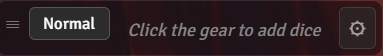
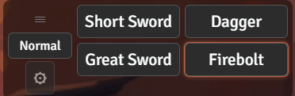
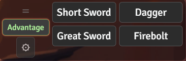
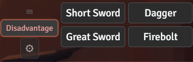
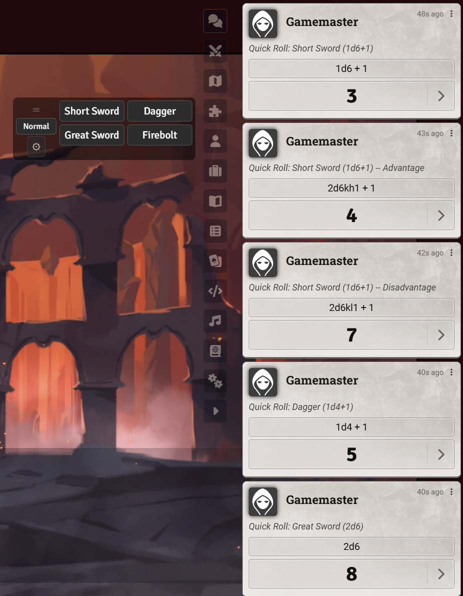
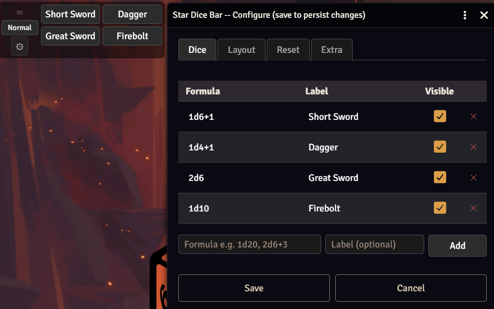
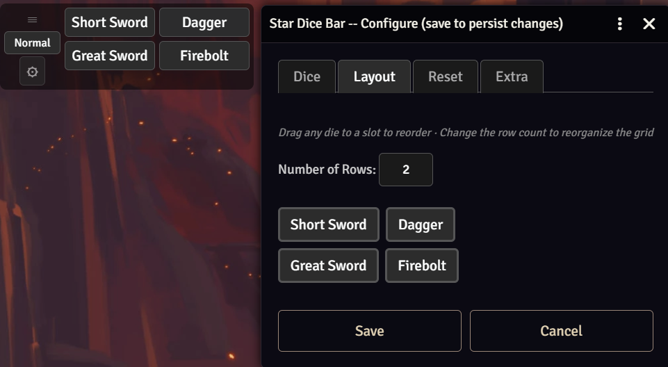
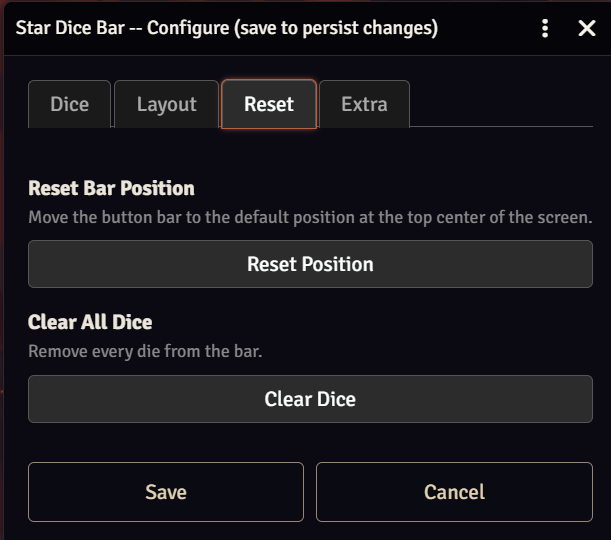
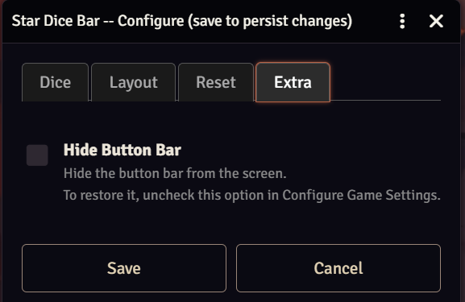

# Star Dice Bar

A FoundryVTT module that adds a draggable quick-access dice bar to the UI. The bar starts empty — every die is a custom die you add yourself.

## Features

- Add any dice formula (e.g. `1d20`, `2d6+3`, `1d8+1d6`) with an optional label/nickname
- One-click rolls posted to chat with flavor text showing the formula and mode used
- Normal / Advantage / Disadvantage toggle — advantage/disadvantage doubles each die term and keeps the highest/lowest half
- Drag-and-drop layout editor with configurable row count
- Per-die visibility toggle so you can hide dice without deleting them
- Draggable bar that remembers its position per user
- Fully localizable — ships with English, French, German, Spanish, and Brazilian Portuguese; more can be added

## Compatibility

| Foundry Version | Status |
|---|---|
| v14 | Verified |

## Installation

1. In Foundry, open **Add-on Modules** and click **Install Module**.
2. Paste the manifest URL into the field at the bottom and click **Install**.
3. Enable the module in your world under **Manage Modules**.

## Examples

The bar starts empty — click the gear (⚙) to add your first die:



Dice you add become one-click buttons in the grid layout you choose. The button on the left cycles the roll mode — **Normal → Advantage → Disadvantage** — and advantage/disadvantage automatically doubles each die term and keeps the highest/lowest half (e.g. `1d20` → `2d20kh1`):

| Normal | Advantage | Disadvantage |
| :---: | :---: | :---: |
|  |  |  |

Clicking a die posts the roll to chat with flavor text showing the die and the mode used:



### Configuration

Clicking the gear opens a dialog with four tabs.

**Dice** — add, edit, delete, and show/hide each die:



**Layout** — drag dice to reorder them and choose how many rows the bar uses:



**Reset** — move the bar back to its default position or clear every die:



**Extra** — hide the bar entirely; re-enable it later from Foundry's game settings:



## Development

### Prerequisites

- [Node.js](https://nodejs.org/) (v18 or later)

### Setup
```bash
npm install
```

### Testing locally in Foundry

Link the project folder into your Foundry modules directory with a directory junction (no admin required):

```cmd
mklink /J "%LOCALAPPDATA%\FoundryVTT\Data\modules\star-dice-bar" "<path-to-this-repo>"
```

After the junction is created, changes in this repo are reflected immediately in Foundry — no copying needed.

Then launch Foundry, enable the module in your world, and open the browser console (`F12`) to watch for errors. Verify:

- The dice bar appears on screen with the drag handle, mode toggle, and gear button
- Opening the gear and adding a die shows it as a button on the bar
- Clicking a die button posts a roll to chat with the correct formula in the flavor text
- Advantage/Disadvantage mode doubles die terms correctly (e.g. `1d20` → `2d20kh1`)
- No errors appear in the console

### Running the automated test suite

```bash
npm test
```

The suite uses [Jest](https://jestjs.io/) with a jsdom environment to test the module without a running Foundry instance. It covers:

- **DOM structure** — the dice bar is appended to `body` with the correct controls and shows the empty-bar hint when no dice are configured
- **Click behavior** — custom dice buttons roll the correct formula, evaluate it, and post to chat with the correct speaker and flavor text
- **Advantage/disadvantage** — `buildRollFormula` rewrites die terms correctly for each mode
- **Config dialog** — tab switching, adding/deleting dice, inline formula editing, duplicate detection, drag-and-drop reordering, row count changes
- **XSS resilience** — script injection, attribute injection, and `img onerror` payloads in formulas and labels do not execute
- **Resilience** — graceful handling of missing DOM nodes, invalid saved data, and NaN values
- **Localization** — every UI string resolves through `game.i18n`, the English file is complete, and additional languages keep full key/placeholder parity with English
- **Manifest validation** — `module.json` is well-formed, version strings are valid, and all referenced files (scripts, styles, and language files) exist on disk

## Localization

All user-facing text is loaded from JSON language files in [`localization/`](localization/) under the `STARDICEBAR` namespace and registered through the `languages` array in `module.json`. English (`localization/en.json`) is the source of truth. The module ships with English (`en`), French (`fr`), German (`de`), Spanish (`es`), and Brazilian Portuguese (`pt-BR`); Foundry serves each user the file matching their client language and falls back to English for any missing key.

To add a translation:

1. Copy `localization/en.json` to `localization/<lang>.json` (e.g. `de.json`, `fr.json`) and translate the values, leaving the keys and any `{placeholders}` unchanged.
2. Add an entry to the `languages` array in `module.json`:
   ```json
   { "lang": "de", "name": "Deutsch", "path": "localization/de.json" }
   ```
3. Run `npm test` — the localization tests verify the new file has full key and placeholder parity with English.

### Verifying compatibility with a new Foundry version

When a new Foundry version is released:

1. Check the Foundry changelog for changes to any of the APIs this module depends on:
   - `Hooks.once` — used to register `init` and `ready` callbacks
   - `Roll` — constructed with a formula string; `.evaluate()` and `.toMessage()` must exist
   - `ChatMessage.getSpeaker()` — used to populate the chat message speaker
   - `foundry.applications.api.DialogV2.wait` — used for the config dialog
   - `game.user.setFlag / getFlag / unsetFlag` — used for all per-user persistence
   - `game.settings.register / get / set` — used for the `barHidden` client setting
2. Run `npm test` to confirm the test suite still passes.
3. Install the module in a Foundry world running the new version and run through the manual steps above.
4. Update `compatibility.verified` in `module.json` once confirmed working.
